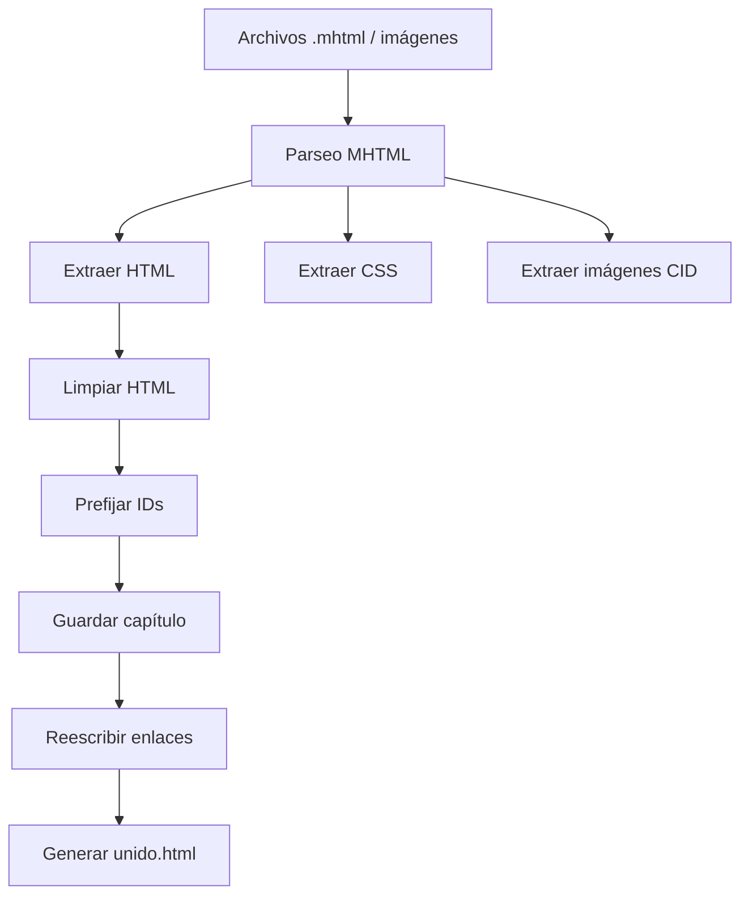

# Unificador MHTML a HTML by Naidel


Convierte múltiples archivos **.mhtml** e imágenes en un único documento
**HTML autocontenido**, listo para archivo o impresión.
Ideal para unificar páginas web en un unico fichero.

---

**Autor:** Antonio Teodomiro Márquez Muñoz  
📧 **Contacto:** atmarquez@gmail.com
💖 **Donaciones:** https://paypal.me/atmarquez 
📦 **Versión actual:** 1.0.0

---

## Características

- Convierte imágenes CID a data-URL
- Incrusta CSS embebido
- Evita colisiones de anclas (`id`, `name`)
- Reescribe enlaces internos
- Optimizado para impresión

## Uso

1. Coloca los archivos `.mhtml` y/o imágenes en el directorio de trabajo.
2. Ejecuta:

```bash
python src/unificador_mhtml.py
```

3. Se generará el archivo `unido.html`.

## Requisitos

- Python 3.9 o superior
- No se requieren dependencias externas

## How it works

El script procesa todos los archivos `.mhtml` e imágenes del directorio
actual y genera un único documento HTML autocontenido.

El proceso se divide en **dos pasadas claramente separadas**:

### 1️⃣ Extracción y normalización

- Se leen los archivos `.mhtml` y las imágenes
- Se extrae el HTML principal de cada MHTML
- Las imágenes CID se convierten a `data:` (base64)
- El CSS se incrusta directamente en el documento
- Los `id` y `name` se prefijan para evitar colisiones

### 2️⃣ Reescritura de enlaces internos

- Se analizan todos los enlaces `href="#ancla"`
- Se reescriben para apuntar a las anclas prefijadas
- Se garantiza que la navegación interna funcione
  en el documento unificado

### Diagrama de flujo



## Licencia

Este proyecto está licenciado bajo la  
**GNU General Public License v3.0 o posterior (GPL‑3.0‑or‑later)**.

Consulta el archivo `LICENSE` para más información.

## 👤 Autor

**Antonio Teodomiro Márquez Muñoz**  
📧 atmarquez@gmail.com

---

## Donaciones

Si este proyecto te resulta útil y quieres apoyar su desarrollo, puedes hacerlo aquí:

❤️ https://paypal.me/atmarquez


**Copyright © 2026 Antonio Teodomiro Márquez Muñoz (Naidel)**
