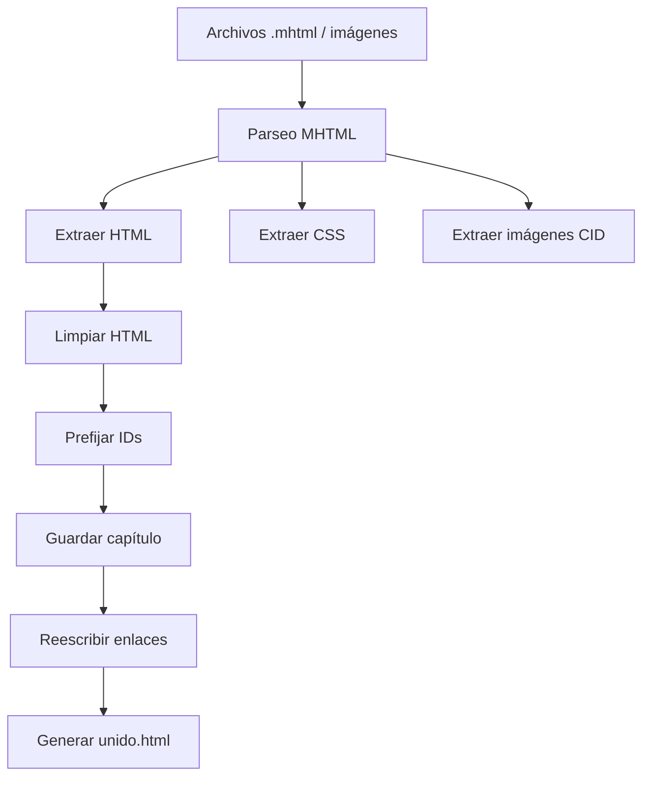

# Unificador MHTML a HTML


Unificador de documentos HTML, MHTML e imágenes en un único archivo HTML
**totalmente autocontenido**, listo para navegación offline, impresión o
exportación a PDF. Ideal para unificar páginas web en un unico fichero.

---

**Autor:** Antonio Teodomiro Márquez Muñoz  
📧 **Contacto:** atmarquez@gmail.com
💖 **Donaciones:** https://paypal.me/atmarquez 
📦 **Versión actual:** 1.0.0

---

## ✨ Características principales

- Une documentos:
  - `.html`, `.htm`, `.xhtml`
  - `.mhtml`
- Incrusta:
  - imágenes embebidas (CID)
  - imágenes locales
  - imágenes remotas (http/https)
  - imágenes sueltas del directorio
- HTML final 100 % autocontenido (Base64)
- Evita auto-inclusión del HTML generado
- Reescribe anclas y enlaces internos
- Evita colisiones de IDs
- Optimizado para impresión:
  - salto de página por documento
  - evita títulos huérfanos
  - evita figuras partidas
- Configurable por línea de comandos

## 📂 Funcionamiento

El programa recorre el **directorio actual** y procesa:

- Imágenes sueltas → páginas HTML embebidas
- Documentos HTML/MHTML → contenidos normalizados e integrados

Todo se unifica en **un único fichero HTML**.


## 🚀 Uso

```bash
python unificador_mhtml.py
```

## ⚙️ Opciones de línea de comandos

```
-o, --output        Nombre del fichero HTML de salida
-t, --title         Título principal del documento
--no-filenames      No mostrar el nombre del fichero antes de cada parte
-V, --version       Mostrar información del programa y salir
-h, --help          Mostrar esta ayuda
```

## Ejemplos

```
# Uso por defecto
python unificador_mhtml.py

# Cambiar nombre y título
python unificador_mhtml.py -o libro.html -t "Manual ISACA CRISC"

# Sin mostrar nombres de fichero
python unificador_mhtml.py --no-filenames
```

## 🖨️ Impresión

El HTML generado está preparado para impresión profesional:

Cada documento comienza en página nueva
Títulos nunca quedan al final de página
Figuras no se dividen entre páginas

Los márgenes y layout finales pueden ajustarse editando el HTML generado.

## Requisitos

- Python 3.9 o superior
- No se requieren dependencias externas

## How it works

El script procesa todos los archivos `.mhtml` e imágenes del directorio
actual y genera un único documento HTML autocontenido.

El proceso se divide en **dos pasadas claramente separadas**:

### 1️⃣ Extracción y normalización

- Se leen los archivos `.mhtml` y las imágenes
- Se extrae el HTML principal de cada MHTML
- Las imágenes CID se convierten a `data:` (base64)
- El CSS se incrusta directamente en el documento
- Los `id` y `name` se prefijan para evitar colisiones

### 2️⃣ Reescritura de enlaces internos

- Se analizan todos los enlaces `href="#ancla"`
- Se reescriben para apuntar a las anclas prefijadas
- Se garantiza que la navegación interna funcione
  en el documento unificado

### Diagrama de flujo



## Licencia

Este proyecto está licenciado bajo la  
**GNU General Public License v3.0 o posterior (GPL‑3.0‑or‑later)**.

Consulta el archivo `LICENSE` para más información.

## 👤 Autor

**Antonio Teodomiro Márquez Muñoz**  
📧 atmarquez@gmail.com

---

## Donaciones

Si este proyecto te resulta útil y quieres apoyar su desarrollo, puedes hacerlo aquí:

❤️ https://paypal.me/atmarquez


**Copyright © 2026 Antonio Teodomiro Márquez Muñoz (Naidel)**